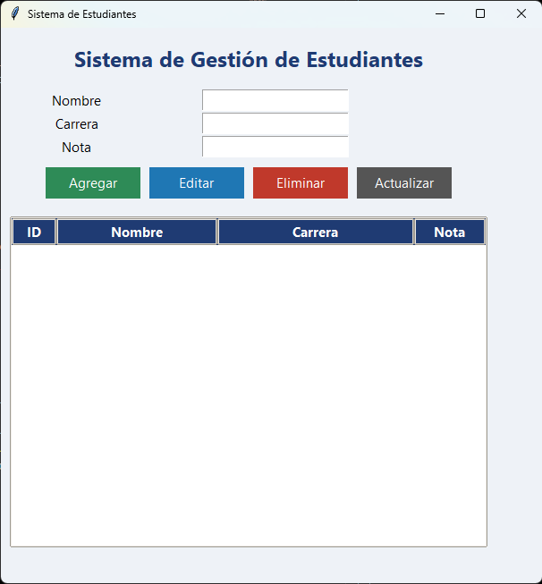

# Sistema de Gestión de Estudiantes

Aplicación de escritorio desarrollada en **Python**, utilizando **Tkinter** para la interfaz gráfica y **SQLite** como base de datos local. El sistema permite administrar estudiantes mediante las operaciones básicas de un CRUD (Crear, Leer, Actualizar y Eliminar).

---

## Características

- Agregar nuevos estudiantes.
- Editar la información de un estudiante.
- Eliminar registros.
- Visualizar todos los estudiantes registrados.
- Actualizar la tabla de datos.
- Base de datos local con SQLite.
- Interfaz gráfica intuitiva y fácil de usar.

---

## Tecnologías utilizadas

- Python 3
- Tkinter
- SQLite3

---

## Estructura del proyecto

```text
Sistema-Gestion-Estudiantes-Python/
│
├── assets/
│   └── captura.png
│
├── sistema_estudiantes.py
├── estudiantes.db
└── README.md
```

---

## Instalación

### 1. Clonar el repositorio

```bash
git clone https://github.com/TU-USUARIO/Sistema-Gestion-Estudiantes-Python.git
```

### 2. Entrar al proyecto

```bash
cd Sistema-Gestion-Estudiantes-Python
```

### 3. Ejecutar la aplicación

```bash
python sistema_estudiantes.py
```

---

## Base de datos

La aplicación crea automáticamente el archivo **estudiantes.db** cuando se ejecuta por primera vez.

### Estructura de la tabla

| Campo | Tipo |
|-------|------|
| id | INTEGER |
| nombre | TEXT |
| carrera | TEXT |
| nota | REAL |

---

## Captura de pantalla

<p align="center">
    
</p>

---

## Funcionalidades

- Crear estudiantes.
- Consultar registros.
- Actualizar información.
- Eliminar estudiantes.
- Interfaz gráfica con Tkinter.
- Persistencia de datos mediante SQLite.

---

## Autor

**Jandro**

Estudiante de Desarrollo de Software.

GitHub: https://github.com/Jostin-Mindiola

---

## Licencia

Este proyecto fue desarrollado con fines educativos y de aprendizaje.
